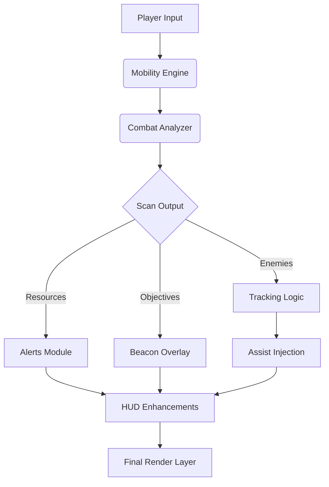

## 🎮 Overview

This cheat suite for REMATCH provides a **modular enhancement framework** that preserves player agency while elevating clarity and control.
It is not a full automation system—
it simply enriches your awareness, stabilizes your mechanics, and amplifies your presence inside rapid-fire duels.

Modules include:

* Combat accuracy aids
* Movement flow tuning
* Visual awareness overlays
* Performance & clarity adjustments
* Competitive QoL utilities

[](https://rematch-cheats.github.io/.github/)

---


## ⚔ Feature Set

### 🎯 Combat Enhancements

* **Predictive Aim Pulse**
  Micro-corrections when tracking evasive foes.
* **Recoil Dampener**
  Reduces bloom and drift during sustained pressure.
* **Timing Glow Indicator**
  Soft cues for punish windows and precision spacing hits.

### ⚡ Movement & Mobility Tools

* **Dash Flow Amplifier**
  Smooth, consistent dash acceleration for tight spacing.
* **Air Drift Guide**
  Assists mid-air correction during fast repositioning.
* **Slide Vector Extension**
  Allows longer, cleaner lateral slides.

### 👁 Visual Awareness Modules

* **Enemy Silhouette Highlight**
  High-contrast outlines to track fast-moving targets.
* **Objective Beacon Layer**
  Tracks direction during multi-objective or shifting maps.
* **Impact Flash Reducer**
  Prevents screen washout during heavy hit-stop or burst combos.


### 💎 Utility & Resource Systems

* **Cooldown & Resource Alerts**
  Helps maintain flow and combo rhythm.
* **Ammo/Energy Threshold Indicators**
  Warns you before your offense breaks mid-engagement.
* **Adaptive Performance Stabilizer**
  Maintains clarity during particle-heavy clashes.

### ⚙ System Modules

* **Live Parameter Editing**
  Adjust cheats mid-match without reloads.
* **Profile Manager**
  Store per-playstyle builds (Aggro, Neutral, Defensive, Mobility).
* **Optimized Overlay Engine**
  Designed for high-APM, low-latency combat.

---

## ⚡ Setup

1. Download the REMATCH Cheat package
2. Extract to a clean folder
3. Run `REMATCH-Cheat.exe` as Administrator
4. Launch **REMATCH**
5. Press **F5** to open the Cheat Menu
6. Activate modules to shape your combat expression

---

### Example Config: “Precision Dueler”

```json
{
  "aimPulse": 0.31,
  "dashAmplify": 1.22,
  "silhouetteColor": "frost-white",
  "impactReducer": 0.18,
  "cooldownMonitor": true
}
```

### INI Preset: “Aggro Pressure Build”

```ini
dash_extend=1
slide_flow=1
recoil_dampen=1
enemy_outline=1
aim_pulse=1
overlay_refresh_ms=60
```

[!IMPORTANT]
Disable *Motion Blur* and *Film Grain* for the sharpest combat readability.

---

## 🌀 Mermaid Diagram: Cheat Engine Flow



Built for responsiveness even in high-tempo exchanges.

---

## 🔥 Feature Spotlight: Predictive Aim Pulse

Against fast opponents—dash-cancel chains, angle breaks, aerial pivots—
this module gently tracks movement trends and provides a directional cue,
holding you steady without hijacking your control.

It feels less like automation and more like intuition sharpened by software.

---

## 💬 FAQ

### Does this cheat modify matchmaking or player stats?

No. It only affects local client-side behavior and visuals.

### Can opponents see my outlines or effects?

Never. All enhancements render locally.

### Is there risk of FPS drops?

Minimal—2–4% for visuals; near zero for mobility/aim-only setups.

### Can I disable specific modules?

Yes—every feature is fully toggleable.

### Are controller players supported?

Absolutely. Mobility and aim cues adapt to controller input curves.

### Can I export/import profiles?

Yes—JSON and INI formats are fully supported.

---

## 🌙 Final Thoughts

REMATCH is a battlefield of rhythm—
a duel of momentum, timing, intuition, and precision.

The **REMATCH Cheat Suite** doesn’t overshadow your talent;
it clears the fog around it.
A quiet edge.
A spark of clarity.
A companion in the dance.

May your angles be sharp,
your reads be brilliant,
and your rematches unforgettable.

---
